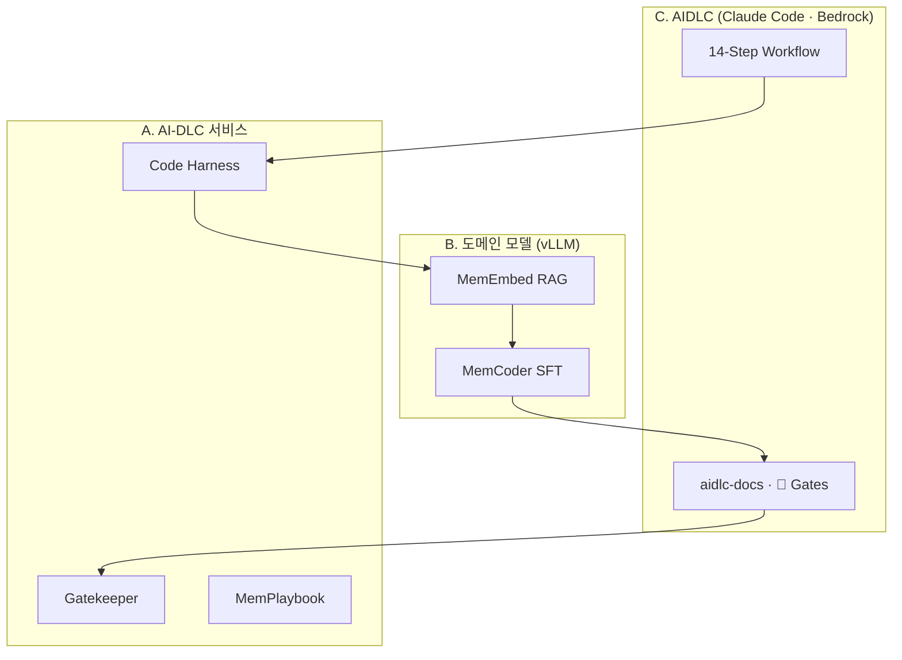
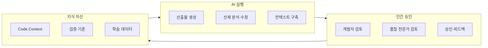

# 26년 팀 하반기 전략 회의 내용

**갱신일**: 2026-06-25 (v3 — AIDLC·Bedrock·인프라 전제 반영)

**AIDLC 참조**: [AIDLC Guide](https://nuriguri1228.github.io/AIDLC-Guide/) (AWS Labs [aidlc-workflows](https://github.com/awslabs/aidlc-workflows))

---

## 0. 삼중 축 전략 (AIDLC + 워크플로우 + 모델)

실장님 관심 **[AIDLC](https://nuriguri1228.github.io/AIDLC-Guide/)** 를 중심 방법론으로, 팀 AI-DLC 전략·교육 현업 과제를 정렬한다.

| 축 | 초점 | 핵심 산출물 |
|----|------|-------------|
| **C. AIDLC 방법론** | 3-Phase · 14-Step, Question→Doc→👤 Approval | aidlc-docs 산출물, `aidlc-state.md` |
| **A. AI-DLC 워크플로우** | HITL·프로세스·전사 확산 | P1~P7 서비스 |
| **B. 도메인 특화 모델** | Foundation → 후처리 → vLLM 서빙 | M1~M6 |

### 0.0 인프라 전제 (2026-06-25 확인)

| 항목 | 상태 |
|------|------|
| 사내 GPU | ✅ 학습 가능 |
| vLLM 사내 API | ✅ MemCoder 서빙 가능 |
| Claude Code | ✅ **Bedrock 경유** (사내 배포) |
| Open API 직접 호출 | ❌ 불가 |
| Bedrock 코드 입력 | ⚠️ 개인·프로젝트별 판단 |

**추론 기본값**: MemCoder(vLLM) 1차 60%+ / Bedrock Claude escalate 40%↓

---

## 0.1 이중 트랙 (워크플로우 + 모델) — 상세

팀 하반기 AI-DLC 전략과 **AI-Expert 교육 현업 과제**는 같은 문제를 두 레이어에서 풀어야 한다.

| 레이어 | 초점 | 산출물 | 평가·가치 |
|--------|------|--------|-----------|
| **A. AI-DLC 워크플로우** | Agent·HITL·프로세스 | P1~P7 서비스 | 경영 기여도, 전사 확산, 고객 신뢰 |
| **B. 도메인 특화 모델** | Foundation → 후처리 → 서빙 | M1~M6 모델·API | 교육 이해도·활용도·완성도, 토큰 비용·온프레미스 통제 |

> **핵심 원칙**: Claude Code(Bedrock)가 **AIDLC 오케스트레이터**를 담당하고, **MemCoder(vLLM)+Harness**가 Brownfield 컨텍스트·도메인 추론을 담당하는 **3층 스택**이 기본이다.

### 0.2 AIDLC Phase ↔ 본 프로젝트 매핑

메모리사 = **Brownfield** 위주. [AIDLC Guide](https://nuriguri1228.github.io/AIDLC-Guide/) 14-Step 중 본 과제 연동 지점:

| Phase | Step | 본 과제 |
|-------|------|---------|
| Inception | Reverse Engineering | **P3 Code Harness** — architecture·API·code-structure |
| Inception | Requirements · Design | **M2 MemEmbed** RAG, Bedrock escalate |
| Construction | Code Generation | **M1 MemCoder** (vLLM), 👤 Plan 승인 |
| Construction | Build and Test | P4 Preempt-QA (확장), HITL |
| 전 Phase | Approval Gates (👤) | P1 Gatekeeper, **P5 FeedbackLoop** → M5 DPO |



### 0.3 커리큘럼 ↔ 모델 후처리 매핑

| 교육 영역 (강의) | 후처리 기법 | 적용 프로젝트 |
|------------------|-------------|---------------|
| Word Embedding / IR (황승원) | 도메인 임베딩, 하이브리드 검색 | M2 MemEmbed, P2/P3 RAG |
| RAG / Prompting (여진영) | Retrieval 파이프라인, CoT 템플릿 | P2 DocForge, P3 Code Harness |
| RLHF / Distillation (여진영) | DPO·선호 정렬, Teacher→Student 증류 | M5 PrefAlign, M6 MemDistill |
| Code Model / Agentic LLM (황승원) | 코드 SFT, tool-use fine-tuning | M1 MemCoder, P4 Preempt-QA |
| RL PPO/GRPO (양인순) | 라우팅·품질 reward 모델 | M4 MemRouter |
| Continual / Domain Adapt (7월) | 파일럿 피드백 기반 점진 학습 | M5 + P5 FeedbackLoop |

---

## 1. 전략 방향

SW개발 전주기를 AI 기반의 **AI-DLC** 체계로 전환한다.

SW개발 단계를 **AI 실행-인간 승인** 구조로 재설계해 개발속도를 높이고, 품질과 고객신뢰를 확보한다.

| 기존 | 목표 |
|------|------|
| 개발자가 산출물을 직접 작성 | AI Agent가 단계별 산출물을 자동 생성 |
| 리뷰·검증이 사후 대응 | 담당자는 **명시적 검토·승인**에 집중 |
| 자동화 = 속도만 | **품질 개선 + 지식 자산화**까지 연결하는 AI-Native SW 개발 체계 |



---

## 2. 전사 확산 로드맵

메모리사 파일럿에서 검증된 AI기반 품질 향상 체계를 **전사 개발 프로세스**로 확산한다.

**핵심 인프라 두 축**

1. **고품질 Code Context** — 대규모 코드베이스, 설계 문서, HW 스펙을 AI가 이해·검색 가능한 형태로 유지
2. **HITL 검증 체계** — AI 산출물을 개발자·품질 전문가가 검토·승인하고, 피드백을 **지속 학습 가능한 기준**으로 내재화

| 단계 | 시기 | 목표 |
|------|------|------|
| **Pilot** | 하반기 Q3 | 메모리사 1~2개 프로젝트에서 AI-DLC 워크플로우·메트릭 검증 |
| **Package** | Q3~Q4 | HITL 게이트·문서 스키마·Agent 스킬을 재사용 패키지로 표준화 |
| **Scale** | 2027 H1 | 타 사업부 온보딩 — RepoScout + Playbook + HITL 대시보드 일괄 배포 |

---

## 3. 메모리사 맞춤형 AI-DLC 추진 전략 (기존 3대 축)

### 3.1 Large Codebase 이해 해결 — AI Code Harness

- 수백만 LOC 규모 코드베이스를 **계층적 인덱싱**(모듈 맵, 의존 그래프, 핫스팟 요약)으로 AI 컨텍스트에 공급
- 변경 영향 분석·레거시 추적 시 토큰 낭비 없이 관련 서브트리만 주입

### 3.2 설계·HW 문서 AI-Ready화

- **대상**: SRS, DLD, SFR, HW Packet
- **형태**: Text(정제 본문) + Schema(구조화 메타데이터) + Visualization(다이어그램·인터페이스 맵)
- **효과**: 요구↔설계↔코드 **트레이서빌리티**를 Agent가 자동 유지

### 3.3 품질 이슈 선제 개선 Agent

- 정적 분석·이력 데이터·코드 패턴을 결합해 이슈 **선제 탐지**
- 수정안·테스트 보강안을 AI가 제안하고, HITL 승인 후 반영
- 사후 버그 대응 비용을 설계·구현 단계로 앞당김

---

## 4. 하반기 신규 프로젝트 아이디어

> 메모리사 파일럿 3대 축을 **실행 가능한 제품·서비스**로 쪼갠 제안. 팀 기존 자산(코드 리뷰 에이전트, ETL, DSA, Claude Code 도입 지원)과 정합성을 기준으로 우선순위를 표기했다.

### Tier 1 — 파일럿 직결 (Q3 착수 권장)

#### P1. **AIDLC Gatekeeper** — 단계별 HITL 승인 워크플로우 엔진

| 항목 | 내용 |
|------|------|
| **한 줄** | 요구→설계→구현→검증 각 단계에서 AI 산출물의 **검토·승인·반려**를 표준화하는 게이트 시스템 |
| **해결 문제** | Agent가 산출물을 많이 만들어도, 누가·무엇을·어떤 기준으로 승인하는지 불명확하면 신뢰 확보 실패 |
| **핵심 기능** | 단계별 체크리스트 템플릿, diff/문서 비교 뷰, 승인자 라우팅, 반려 시 피드백 → Agent 재생성 루프 |
| **파일럿 연계** | 메모리사 AI-DLC의 **인간 승인** 구조를 제품화 → 전사 확산 시 그대로 이식 |
| **기존 자산** | 코드 리뷰 에이전트의 리뷰 UI·승인 패턴, ETL의 이벤트 로그 파이프라인 |
| **KPI** | 단계별 1차 승인률, 반려→재승인 소요 시간, HITL 없이 머지된 변경 비율 |

#### P2. **DocForge** — SRS/DLD/SFR/HW Packet AI-Ready 파이프라인

| 항목 | 내용 |
|------|------|
| **한 줄** | 분산된 Word/PDF/도면 문서를 **Text + Schema + Visualization** 삼중 구조로 자동 변환·동기화 |
| **해결 문제** | 대형 메모리 프로젝트는 설계 문서가 형식·위치가 제각각이라 Agent 컨텍스트 품질이 낮음 |
| **핵심 기능** | 문서 파서·스키마 추출(LLM+규칙), 요구 ID↔설계 항목↔코드 심볼 링킹, 변경 시 stale 마킹 |
| **파일럿 연계** | 3.2 AI-Ready화 축의 **MVP** — Code Harness(P3)의 상위 컨텍스트 레이어 |
| **기존 자산** | DSA 위키·Q&A 코퍼스 정제 경험, 사내 컨벤션 RAG |
| **KPI** | AI-Ready 문서 커버리지(%), 요구-코드 추적 누락 건수, Agent 답변 근거 인용 정확도 |

#### P3. **Code Harness** — Large Codebase 컨텍스트 서빙 플랫폼

| 항목 | 내용 |
|------|------|
| **한 줄** | 대규모 코드베이스를 **모듈 맵 + 의존 그래프 + 시맨틱 청크**로 인덱싱해 Agent에 정밀 주입 |
| **해결 문제** | 전체 repo를 넣으면 토큰 초과, 일부만 넣으면 영향 범위 누락 — 메모리 FW/SW의 구조적 난제 |
| **핵심 기능** | Repo 구조 요약 자동 갱신, 변경 diff 기반 영향 서브트리 추출, DocForge(P2) 심볼과 크로스 레퍼런스 |
| **파일럿 연계** | 3.1 AI Code Harness 축 — 메모리사 대형 repo 1~2개 파일럿 |
| **기존 자산** | RepoScout(가이드 자동 생성기) 분석기, 코드 리뷰 ETL의 repo 메타데이터 |
| **KPI** | Agent 태스크당 평균 컨텍스트 토큰, 영향 분석 정밀도(사람 평가), 설정 없이 온보딩 소요 시간 |

### Tier 2 — 품질·자산화 강화 (Q3 병행, Q4 확장)

#### P4. **Preempt-QA** — 품질 이슈 선제 개선 Agent

| 항목 | 내용 |
|------|------|
| **한 줄** | 커밋·PR·야간 배치에서 품질 이슈를 **선제 탐지→수정안 제안→HITL 승인**하는 Agent |
| **해결 문제** | 3.3 축의 실행체. 메모리 도메인 특화 결함 패턴(타이밍, 리소스, 인터페이스 불일치)을 사후가 아닌 사전에 차단 |
| **핵심 기능** | 정적 분석 + LLM reasoning 하이브리드, 유사 과거 이슈 RAG, 자동 테스트 케이스 보강 제안 |
| **파일럿 연계** | Gatekeeper(P1) 승인 게이트 통과 후에만 머지 |
| **기존 자산** | AI Code Review Agent 운영 데이터, 리뷰 코멘트 코퍼스 |
| **KPI** | 선제 탐지 이슈 건수, 프로덕션 결함 대비 선행 비율, false positive율 |

#### P5. **FeedbackLoop** — HITL 피드백 → 지속 학습형 지식 자산

| 항목 | 내용 |
|------|------|
| **한 줄** | 승인·반려·수정 피드백을 구조화해 **팀별 품질 기준·few-shot·선호 데이터셋**으로 축적 |
| **해결 문제** | HITL이 일회성 검토에 그치면 자산화 실패 — "지속 학습형 개발 지식" 전략의 핵심 루프 |
| **핵심 기능** | 피드백 스키마 표준화, 기준 문서 자동 갱신, Agent 프롬프트/스킬에 동적 반영, 익명화·거버넌스 |
| **파일럿 연계** | P1~P4 전체의 **데이터 허브** — 전사 확산 시 팀별 기준 이식 |
| **기존 자산** | ETL 파이프라인, Claude Code 사용 로그(활용 패턴 라벨) |
| **KPI** | 피드백→기준 반영 리드타임, 동일 유형 반려 재발률, Agent 2차 제안 일치율 |

### Tier 3 — 전사 확산·도입 가속 (Q4, 파일럿 검증 후)

#### P6. **MemPlaybook** — 메모리사 AI-DLC 표준 Playbook 패키지

| 항목 | 내용 |
|------|------|
| **한 줄** | 메모리 FW/SW SDLC에 맞춘 **Claude Code skill·slash command·hook·MCP 번들** + 단계별 프롬프트 |
| **해결 문제** | 파일럿 성공 요인을 "사람 노하우"가 아닌 **재설치 가능한 패키지**로固化 |
| **핵심 기능** | SDLC 단계별 Agent 시나리오, DocForge·Code Harness 연동 프리셋, Gatekeeper 워크플로우 ID 매핑 |
| **전사 연계** | RepoScout로 타 사업부 repo에 자동 커스터마이즈 후 배포 |
| **KPI** | Playbook 적용 프로젝트 수, 신규 개발자 Time-to-first-PR, Claude Code 활용률 |

#### P7. **AIDLC Dashboard** — AI-DLC 성숙도·품질 가시화

| 항목 | 내용 |
|------|------|
| **한 줄** | 프로젝트별 **AI 실행 비율, HITL 승인 효율, 품질·생산성 상관**을 한 화면에 집계 |
| **해결 문제** | 경영·팀장 보고용 정량 근거 — "AI-DLC 전환이 실제로 속도·품질에 기여하는가" 입증 |
| **핵심 기능** | 단계별 AI/인간 시간 비율, 선제 QA 적중률, 고객 신뢰 지표(결함 밀도·재오픈율) 연동 |
| **기존 자산** | 개발 활동 데이터 ETL, Claude Code 활용도 분석(후보 3) |
| **KPI** | 리드타임 단축 %, 결함 밀도 변화, AI-DLC 성숙도 스코어 |

---

## 4-B. 도메인 특화 모델 프로젝트 (교육·서빙 축)

> **공통 아키텍처**: OSS Foundation Model → 데이터 준비·익명화 → 후처리(SFT/RAG/DPO/Distill) → 평가 벤치 → 사내 Serving API → P1~P7 Agent가 MCP/HTTP로 호출.

### 모델 스택 참조 아키텍처

```
[Foundation]  CodeLlama / Qwen2.5-Coder / StarCoder2 / 사내 베이스 모델
      │
      ├─ SFT ──────────► M1 MemCoder      (코드 생성·이해)
      ├─ Contrastive ──► M2 MemEmbed      (코드·문서 검색)
      ├─ Classify/SFT ─► M3 MemGuard      (결함·리스크 분류)
      ├─ Reward/Route ─► M4 MemRouter     (고/저난이도 라우팅)
      ├─ DPO/RLHF ─────► M5 PrefAlign     (HITL 선호 정렬)
      └─ Distillation ─► M6 MemDistill    (경량 온프레미스 서빙)
                              │
                              ▼
                    [Serving] vLLM · TGI · 사내 Model API
                              │
                              ▼
                    P3 Harness / P4 Preempt-QA / P1 Gatekeeper ...
```

### Tier M1 — 현업 과제 핵심 (8월 착수, 교육 평가 직결)

#### M1. **MemCoder** — 메모리 도메인 코드 모델 SFT

| 항목 | 내용 |
|------|------|
| **한 줄** | OSS Code Foundation Model을 메모리 FW/SW 코드·리뷰 코퍼스로 **SFT**해 도메인 코드 이해·생성 모델을 서빙 |
| **베이스 모델** | Qwen2.5-Coder-7B / StarCoder2-7B (GPU·라이선스 사내 확인) |
| **학습 데이터** | 익명화된 repo 스니펫, 리뷰 코멘트↔패치 쌍, 사내 컨벤션 문서 |
| **후처리** | SFT(LoRA/QLoRA) → 도메인 벤치(리뷰 코멘트 재현율, 패치 적합도) |
| **서빙** | vLLM 기반 내부 API — P3 Code Harness·P4 Preempt-QA의 **1차 추론 엔진** |
| **커리큘럼** | Code Model(황승원), Transformer·Fine-tuning(윤성로/여진영) |
| **KPI** | HumanEval 변형 점수, 리뷰 코멘트 BLEU/승인율, 외부 API 대비 호출 비용 |

#### M2. **MemEmbed** — 코드·설계 문서 도메인 임베딩

| 항목 | 내용 |
|------|------|
| **한 줄** | 코드·SRS/DLD·SFR를 같은 벡터 공간에 매핑하는 **도메인 특화 임베딩** 모델 |
| **베이스 모델** | bge/codebert 계열 → Contrastive fine-tuning |
| **학습 데이터** | 요구 ID↔설계 항목↔코드 심볼 트리플렛(P2 DocForge 산출), 리뷰 링크 |
| **후처리** | InfoNCE / triplet loss, hard negative mining |
| **서빙** | Embedding API + 벡터 DB — P2·P3 RAG의 retrieval core |
| **커리큘럼** | Word Embedding, IR(황승원), RAG(여진영) |
| **KPI** | MRR@10, 요구→코드 검색 Hit@5, RAG 답변 근거 정확도 |

#### M5. **PrefAlign** — HITL 피드백 기반 DPO/RLHF 정렬

| 항목 | 내용 |
|------|------|
| **한 줄** | Gatekeeper·코드 리뷰의 **승인/반려 선호 쌍**으로 M1 MemCoder를 DPO(또는 RLHF) 정렬 |
| **베이스 모델** | M1 SFT 체크포인트 |
| **학습 데이터** | P5 FeedbackLoop의 (chosen, rejected) 패치·코멘트 쌍 |
| **후처리** | DPO(trl) → 필요 시 reward model + PPO(양인순 영역) |
| **서빙** | M1과 동일 엔드포인트, 버전 태그(`memcoder-v1-dpo`) |
| **커리큘럼** | RLHF(여진영), PPO/GRPO(양인순) — **논문 2 주제와 직결** |
| **KPI** | HITL 1차 승인률, 동일 유형 반려 재발률, Win-rate vs SFT-only |

### Tier M2 — 효율·라우팅 (Q3 후반~Q4)

#### M3. **MemGuard** — 품질·결함 분류 모델 (경량)

| 항목 | 내용 |
|------|------|
| **한 줄** | PR diff를 입력받아 **결함 유형·심각도·수정 필요 여부**를 분류하는 소형 모델 |
| **베이스 모델** | 1~3B code LM 또는 encoder-classifier head |
| **역할** | P4 Preempt-QA의 **1차 필터** — LLM reasoning 전에 고위험 변경만 선별(비용·속도) |
| **커리큘럼** | ML Foundation, Weakly Supervised(7월) |
| **KPI** | Recall@고위험, false positive율, P4 전체 지연 시간 |

#### M4. **MemRouter** — Big-Little LLM 라우팅 모델

| 항목 | 내용 |
|------|------|
| **한 줄** | 태스크 난이도·불확실성을 예측해 **사내 튜닝 모델 vs 외부 Claude** 호출을 자동 분기 |
| **베이스 모델** | 소형 classifier 또는 distilled router (0.5~3B) |
| **학습 데이터** | Claude Code 사용 로그 + M1 성공/실패 라벨 + 토큰·품질 메트릭 |
| **후처리** | GRPO/PPO로 cost-quality reward 정렬 가능 |
| **서빙** | 라우팅 정책 API — 기존 하이브리드 오케스트레이션 제안과 통합 |
| **커리큘럼** | RL(양인순), Agentic LLM(황승원) |
| **KPI** | 토큰 절감 %, 품질 유지율, 잘못된 escalate 비율 |

#### M6. **MemDistill** — Teacher→Student 증류 (온프레미스 경량화)

| 항목 | 내용 |
|------|------|
| **한 줄** | 외부 Claude + M1 Teacher 응답을 증류해 **1~3B Student**로 핵심 태스크 재현 |
| **베이스 모델** | Qwen2.5-Coder-1.5B 등 |
| **후처리** | Response distillation, logit/KD — Embedded DL(5월) 개념과 연결 |
| **서빙** | NPU·온디바이스 또는 저비용 배치 — M3/M4와 cascade |
| **커리큘럼** | Distillation(여진영), Embedded DL(하순회) |
| **KPI** | Teacher 대비 capability retention %, latency, 단일 추론 비용 |

---

## 5. 프로젝트 조합 및 추천

### 5.1 권장 번들 (메모리사 파일럿 + 현업 과제)

**워크플로우 트랙 (P)**

```
DocForge (P2) + Code Harness (P3)  →  컨텍스트 기반
         ↓
Preempt-QA (P4) + Gatekeeper (P1)  →  AI 실행 + 인간 승인
         ↓
FeedbackLoop (P5)                    →  지식 자산화
         ↓
MemPlaybook (P6) + Dashboard (P7)  →  전사 확산
```

**모델 트랙 (M)** — P 트랙과 수직 연동

```
M2 MemEmbed (검색)  ──►  P2/P3 RAG 품질 확보
M1 MemCoder (SFT)   ──►  P3/P4 추론 엔진
M5 PrefAlign (DPO)  ──►  P1/P4 HITL 선호 반영 (P5 데이터)
M3 MemGuard (분류)  ──►  P4 1차 필터 (비용 절감)
M4 MemRouter        ──►  외부 Claude ↔ 사내 모델 분기
M6 MemDistill       ──►  Q4 경량·온프레미스 확장
```

### 5.2 현업 과제(8월~) 권장 구성 — **하이브리드 메인**

교육 평가(이해도·활용도·완성도)와 팀 전략을 동시에 만족하는 **단일 메인 과제** 제안:

> **「MemCoder + Code Harness」** — 메모리 도메인 코드 모델 SFT·서빙 + Large Codebase RAG 하네스를 통합한 AI-DLC 실행 엔진

| 구성 요소 | 트랙 | 8~10월 마일스톤 |
|-----------|------|-----------------|
| M1 MemCoder SFT + Serving | 모델 | 8월: LoRA SFT baseline, 9월: vLLM API, 10월: DPO(M5) |
| M2 MemEmbed | 모델 | 8월: triplet 학습, P3 retrieval 연동 |
| P3 Code Harness | 워크플로우 | 8월: 인덱싱 MVP, M1/M2 API 연동 |
| P4 Preempt-QA (축소) | 워크플로우 | 9월: M1+M3 기반 리뷰 제안 데모 |
| P5 FeedbackLoop (데이터만) | 공통 | 8월부터 피드백 스키마·수집 — M5 학습용 |

**RepoScout·Gatekeeper**는 모델 API를 호출하는 **클라이언트 레이어**로 흡수하거나, 일정 여유 시 P1을 축소 MVP로 병행.

### 5.3 현업 과제·팀 업무·논문 매핑

| 프로젝트 | 현업 과제 | 팀 운영 업무 | 논문 연계 |
|----------|-----------|--------------|-----------|
| **M1 MemCoder** | **메인** | 코드 리뷰 Agent 백엔드 | 논문 2 (Code Model) |
| **M2 MemEmbed** | **메인** | DSA·리뷰 RAG | 논문 1 (RAG 효과) |
| **M5 PrefAlign** | 2차 | HITL 피드백 | 논문 2 (RLHF/DPO) |
| M4 MemRouter | 확장 | Claude Code 라우팅 | 논문 1 (활용 패턴) |
| P3 Code Harness | **메인** | Claude Code 온보딩 | — |
| P1 Gatekeeper | 병행 | 코드 리뷰 UI | — |
| P4 Preempt-QA | 병행 | AI Code Review | — |
| P5 FeedbackLoop | **필수** | ETL·사용 로그 | 논문 1·2 공통 |
| P6 MemPlaybook | Q4 | 사내 BP 확산 | — |
| P7 Dashboard | Q4 | 개발 지표 | 논문 1 |

### 5.4 우선순위 (팀 + 교육 병행 기준)

| 순위 | 프로젝트 | 트랙 | 이유 |
|------|----------|------|------|
| **1** | **M1 MemCoder** | 모델 | 교육 핵심 요건(파운데이션→SFT→서빙) 충족 + P3/P4 엔진 |
| **2** | **M2 MemEmbed** | 모델 | RAG·IR 커리큘럼 직결, P2/P3 품질의 전제 |
| **3** | P3 Code Harness | 워크플로우 | 메모리사 Large Codebase pain, M1/M2 통합 지점 |
| **4** | P5 FeedbackLoop | 공통 | M5 DPO·지속 학습의 데이터 파이프라인 — 늦으면 재학습 불가 |
| **5** | P1 Gatekeeper | 워크플로우 | AI-DLC "인간 승인" — M5 학습 데이터 생산원 |
| **6** | M5 PrefAlign | 모델 | 9월 이후 M1 위 DPO — 논문 2 실험 본체 |
| **7** | P4 Preempt-QA | 워크플로우 | M1·M3 연동 시 데모 가치 최대 |
| **Q4** | M4/M6 | 모델 | 토큰·비용 최적화, 증류·라우팅 심화 |

---

## 6. 리스크 및 전제 조건

| 리스크 | 대응 |
|--------|------|
| 설계 문서 접근·보안 | IT/법무 컨펌, DocForge 파싱 범위 화이트리스트 |
| HITL 부담 증가 | Gatekeeper에서 승인자·체크리스트 최소화, M3 MemGuard 1차 필터 선행 |
| 파일럿→전사 이식 실패 | MemPlaybook(P6)을 파일럿 Day 1부터 산출물로 병행 작성 |
| Agent 환각·오수정 | P4는 제안만, 머지는 HITL 필수; 결정론적 검증(lint/test) 게이트 |
| **GPU·학습 인프라 부재** | 7월 중 사내 GPU quota / 연구용 클러스터 확보 — M1/M2 블로커 |
| **학습 데이터 라이선스** | 코드·리뷰 데이터 익명화 파이프라인 + IT/법무 컨펌 (5월 마일스톤 선행) |
| **베이스 모델 선정 지연** | 7월까지 Qwen2.5-Coder·StarCoder2 중 1개 고정 — LoRA로 멀티 모델 실험은 2차 |
| **Agent-only 과제로 편향** | 현업 과제 제안서에 **M1 SFT·Serving 결과물**을 필수 산출물로 명시 |
| **튜닝 모델 품질 < 외부 API** | M4 Router로 하이브리드 유지 — 전량 대체가 아닌 **cost-quality 최적 분기** |

**전제**

1. 메모리사 파일럿 1~2개 PM·개발자·품질 담당자 참여 합의
2. **사내 모델 서빙 API** 또는 vLLM 배포 슬롯 (M1 inference)
3. **주임교수** (황승원 Code Model / 여진영 RAG·RLHF) — 모델 후처리 방향 사전 컨펌

---

## 7. 다음 액션

- [ ] 메모리사 파일럿 대상 프로젝트·담당자 확정
- [ ] **7월 말까지**: 베이스 모델·GPU 환경·HuggingFace/trl 학습 스택 PoC (M1 LoRA 1회 성공)
- [ ] **7월 말까지**: 학습 데이터 샘플 1K건 (코드 스니펫 + 리뷰 쌍) 익명화·법무 컨펌
- [ ] P2/P3 대상 repo·문서 샘플 1세트 수집 → M2 triplet 라벨링
- [ ] P5 FeedbackLoop 피드백 스키마 설계 (M5 DPO chosen/rejected 포맷 포함)
- [ ] **8월 현업 과제 메인 확정**: `MemCoder(M1) + Code Harness(P3) + MemEmbed(M2)` 하이브리드 제안서 작성
- [ ] 황승원/여진영 교수 면담 — SFT·RAG·DPO 실험 설계 및 주임교수 지정