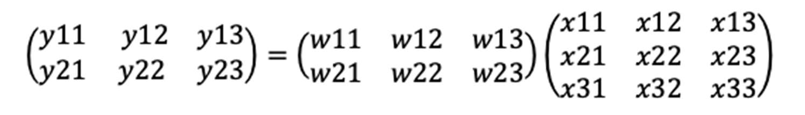
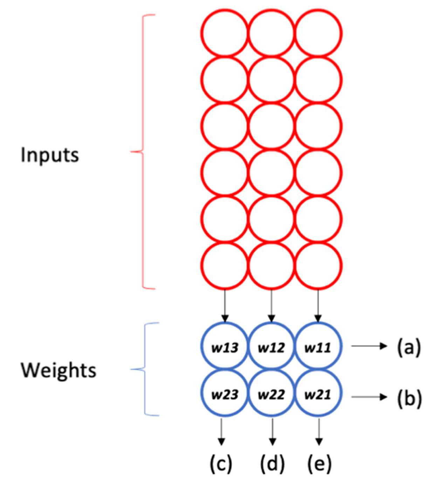
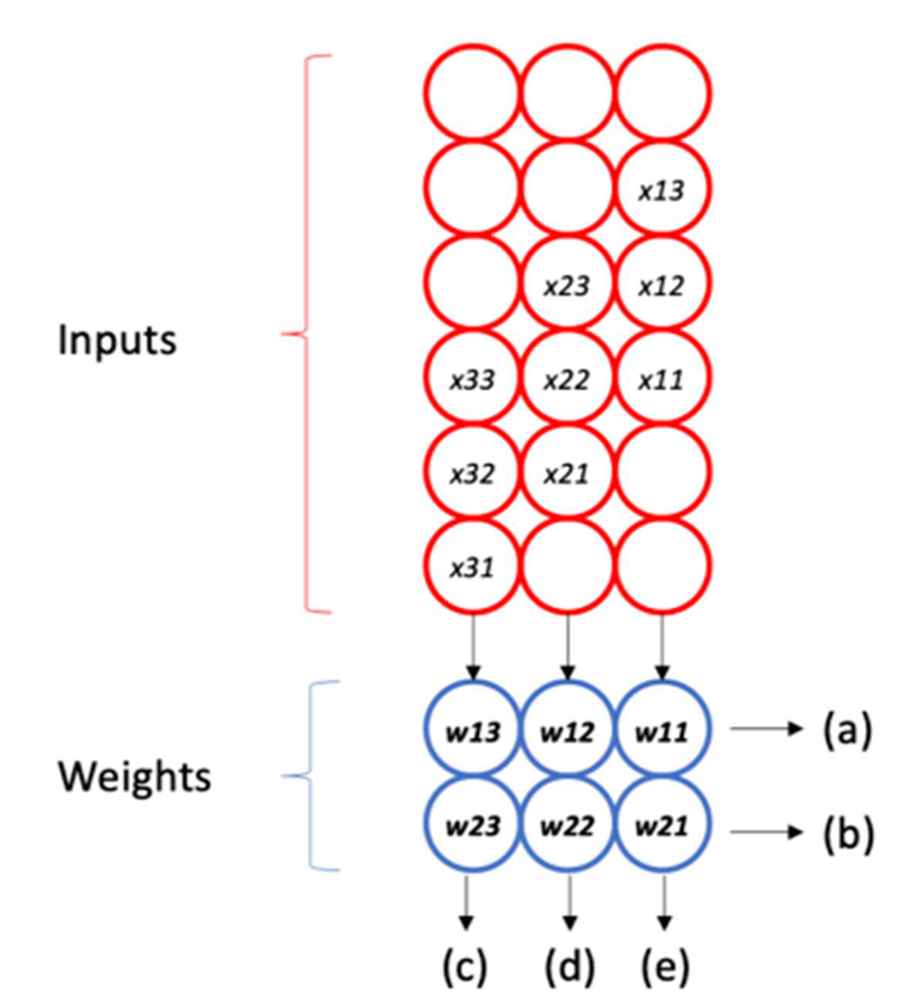

# Samsung AI Expert 2026 과정 문제

과목명: **NPU Basics & Open-Source HW**  
담당교수: **이재욱**

---

## 문제 1

컴퓨터 시스템의 성능은 흔히 **Iron Law of CPU Performance**로 알려진 다음 공식으로 분석한다.

$$\text{CPU Time} = \text{Instruction Count (IC)} \times \text{Cycles per Instruction (CPI)} \times \text{Clock Cycle Time}$$

어떤 CPU의 호스트 프로세서에서 추론(inference) 파이프라인 프로그램을 실행한다. 이 프로세서의 클럭 속도(clock rate)는 `2 GHz`이며, 프로그램의 총 명령어 수(IC)는 `4 × 10^9`개이다. 명령어 클래스별 구성 비율과 CPI는 아래 표와 같다.

| 명령어 클래스 | 비율 | CPI_i |
|---|---:|---:|
| ALU | 50% | 1 |
| Load | 20% | 4 |
| Store | 10% | 3 |
| Branch | 20% | 2 |

1. 이 프로그램의 평균 CPI를 구하시오.
2. Iron Law를 이용하여 이 프로그램의 총 CPU Time(초)을 구하시오.
3. 컴파일러 최적화를 적용한 결과 Load 명령어의 절반이 제거되었다. 제거된 Load 명령어는 단순히 사라지며, 나머지 명령어의 개수와 CPI는 변하지 않는다. 최적화 후의 CPU Time을 구하고, 원래 대비 성능이 몇 배가 되었는지 구하시오.

### 답안

1. 평균 CPI:

$$0.5 \times 1 + 0.2 \times 4 + 0.1 \times 3 + 0.2 \times 2 = 0.5 + 0.8 + 0.3 + 0.4 = 2.0$$

2. Clock Cycle Time:

$$\text{Clock Cycle Time} = \frac{1}{2 \times 10^9\ \text{Hz}} = 0.5 \times 10^{-9}\ \text{초}$$

CPU Time:

$$\text{CPU Time} = (4 \times 10^9) \times 2.0 \times (0.5 \times 10^{-9}) = 4.0\ \text{초}$$

또는 총 사이클 수로 계산하면:

$$4 \times 10^9 \times 2.0 = 8 \times 10^9\ \text{cycles}$$

$$\frac{8 \times 10^9}{2 \times 10^9} = 4.0\ \text{초}$$

3. 원래 Load 명령어 수:

$$4 \times 10^9 \times 20\% = 0.8 \times 10^9\ \text{개}$$

이 중 절반이 제거되므로 제거된 Load 명령어 수는 `0.4 × 10^9`개이다.

제거된 사이클:

$$0.4 \times 10^9 \times 4 = 1.6 \times 10^9\ \text{cycles}$$

최적화 후 총 사이클:

$$8 \times 10^9 - 1.6 \times 10^9 = 6.4 \times 10^9\ \text{cycles}$$

최적화 후 CPU Time:

$$\frac{6.4 \times 10^9}{2 \times 10^9} = 3.2\ \text{초}$$

성능 비:

$$\frac{\text{원래 CPU Time}}{\text{최적화 후 CPU Time}} = \frac{4.0}{3.2} = 1.25$$

따라서 원래 대비 **1.25배 빨라짐**.

---

## 문제 2

Google TPUv1은 행렬-행렬 곱셈을 계산하기 위해 **systolic array** 아키텍처를 채택하였다. 이 아키텍처에서 아래의 입력 행렬 `X`와 파라미터 행렬 `W`의 곱을 계산한다고 가정한다.

### (1)

Systolic array의 입력 `X`는 어떻게 적용되어야 하는가? 아래 입력 요소(빨간색 원)를 채우시오. 사용하지 않는 상자는 비워 두시오. 힌트: weight 파라미터의 배치에 유의할 것.

### 답안

참고: 입력의 y축은 미러링될 수 있음. 즉, `x33-x23-x13`이 가장 먼저 들어오는 형태도 만점.

### (2)

6개의 출력값 `y11`부터 `y23`까지 각각은 어느 방향으로 나가는가? 그림의 `(a)`부터 `(e)` 중 하나를 선택하라.

### 답안

- `y11`, `y12`, `y13` -> `(a)`
- `y21`, `y22`, `y23` -> `(b)`

### (3)

마지막으로 출력되는 출력값은 무엇인가?

### 답안

`y23`

---

## 문제 3

Roofline 모델은 시스템의 성능 병목이 연산(compute)인지 메모리 대역폭(memory bandwidth)인지 시각적으로 분석하는 도구이다. 어떤 NPU의 최대 연산 성능(peak compute)은 `50 TFLOP/s`, 최대 메모리 대역폭(peak memory bandwidth)은 `1 TB/s`이다.

1. 이 NPU의 ridge point에 해당하는 arithmetic intensity(`FLOP/byte`)를 구하시오.
2. 두 개의 DNN 커널을 실행한다. 커널 X의 arithmetic intensity는 `10 FLOP/byte`, 커널 Y는 `200 FLOP/byte`이다. 각 커널이 compute-bound인지 memory-bound인지 판별하고, 각 커널이 이 NPU에서 달성 가능한 성능(attainable performance)을 구하시오.
3. 이 NPU의 메모리 대역폭을 2배(`2 TB/s`)로 늘렸다. 새로운 ridge point는 어떻게 바뀌며, 커널 X와 커널 Y의 attainable performance는 각각 어떻게 변하는지 설명하시오.

### 답안

1. Ridge point의 arithmetic intensity:

$$\text{Ridge point} = \frac{\text{peak compute}}{\text{peak memory bandwidth}}$$

$$= \frac{50 \times 10^{12}\ \text{FLOP/s}}{1 \times 10^{12}\ \text{byte/s}} = 50\ \text{FLOP/byte}$$

2. 커널별 판별:

| 커널 | Arithmetic intensity | 판별 | Attainable performance |
|---|---:|---|---:|
| X | 10 FLOP/byte | `10 < 50`이므로 memory-bound | `(1 × 10^12) × 10 = 10 TFLOP/s` |
| Y | 200 FLOP/byte | `200 > 50`이므로 compute-bound | `50 TFLOP/s` |

3. 메모리 대역폭이 2배가 되면 Roofline의 메모리-바운드 경사선(slanted line)이 위로 평행 이동하고, ridge point의 arithmetic intensity는 다음과 같이 작아진다.

$$\frac{50}{2} = 25\ \text{FLOP/byte}$$

- 커널 X(`AI = 10`): 여전히 `25`보다 작으므로 memory-bound.

$$\text{Attainable performance} = (2 \times 10^{12}) \times 10 = 20\ \text{TFLOP/s}$$

따라서 2배 향상.

- 커널 Y(`AI = 200`): 여전히 `25`보다 크므로 compute-bound.

$$\text{Attainable performance} = 50\ \text{TFLOP/s}$$

연산 성능이 병목이므로 메모리 대역폭 증가의 이득이 없다.
