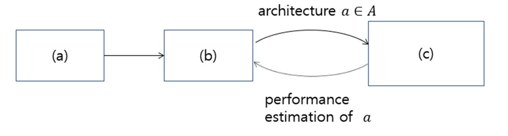

# Samsung AI Expert 2026 과정 문제

과목명: **Embedded Machine Learning**  
담당교수: **하순회**

---

## 문제 1

이종 병렬 시스템으로 구현되는 임베디드 시스템에서 딥러닝 SW를 최적화하기 위해 다음 기법이 추구하는 목표를 간략히 설명하여라.

1. Quantization
2. Pruning
3. Network parallelization

### 답안

1. **Quantization**: 모델의 정확도를 유지하면서 데이터를 표현하는 비트수를 최대로 줄임으로 해서 메모리 사용량을 줄이고자 함. 프로세서가 적은 비트 연산을 지원하면 수행 시간도 줄이는 효과를 얻을 수 있음.
2. **Pruning**: 딥러닝 응용이 redundant한 연산을 수행하고 있기 때문에 수행하는 연산의 개수를 줄임으로 해서 수행 시간을 줄이고자 함.
3. **Parallelization**: 모델의 병렬화를 통해 가용한 프로세서(CPU, GPU, NPU)의 효율을 최대로 높임으로 해서 실시간 성능을 극대화함 (처리량을 높이던지, 지연시간을 줄임).

---

## 문제 2

입력 feature map의 크기가 `W × H × C = 100 × 100 × 100`라고 하자. 커널의 크기가 `3 × 3`인 필터 100개를 적용하는 convolution layer에 대하여 물음에 답하여라. 단, 데이터의 크기는 `INT8`이며, padding을 이용하여 입력과 출력 feature map의 크기를 같게 한다고 가정한다.

1. 이 모델을 수행하기 위해 필요한 MAC 연산의 개수는 얼마인가?
2. `3 × 3` 커널을 사용하는 normal convolution 대신 **Bottleneck 구조(Tucker decomposition)** 를 사용하여 커널의 크기가 `1 × 1`인 필터 50개, `3 × 3`인 필터 50개, 그리고 `1 × 1`인 필터 100개를 순차적으로 사용할 경우 이 모델을 수행하기 위해 필요한 MAC 연산의 개수는 얼마인가?
3. `3 × 3` 커널을 사용하는 normal convolution 대신 **`3 × 3` depthwise convolution과 `1 × 1` pointwise convolution**을 사용하면 이 모델을 수행하기 위해 필요한 MAC 연산의 개수는 얼마인가?

### 답안

1. MAC의 수:

$$100 \times 100 \times 100 \times 3 \times 3 \times 100 = 9.0 \times 10^8$$

2. Bottleneck 구조(Tucker decomposition):

$$100 \times 100 \times 100 \times 1 \times 50 + 100 \times 100 \times 50 \times 3 \times 3 \times 50 + 100 \times 100 \times 50 \times 100$$

$$= (0.5 + 2.25 + 0.5) \times 10^8 = 3.25 \times 10^8$$

3. Depthwise + pointwise convolution:

$$100 \times 100 \times 3 \times 3 \times 100 + 100 \times 100 \times 100 \times 1 \times 100 = 1.09 \times 10^8$$

---

## 문제 3

**Hardware-aware NAS (Neural Architecture Search)** 는 주어진 하드웨어 플랫폼과 시간 제약 조건하에서 최적화된 네트워크 모델을 자동 탐색하는 기술로 아래 그림과 같이 3가지 요소(a, b, c)로 구성되어 있다. 3가지 구성 요소가 무엇인지 간략히 설명하여라.

### 답안

- **(a) Search space (탐색 공간)**: 탐색할 네트워크 모델의 종류와 크기를 결정
- **(b) Search strategy (탐색 방법)**: 탐색 공간을 어떻게 탐색하는 지에 대한 방법 결정
- **(c) Performance estimation strategy (성능 예측 방법)**: 각 대상 모델의 성능을 예측하는 방법 결정

